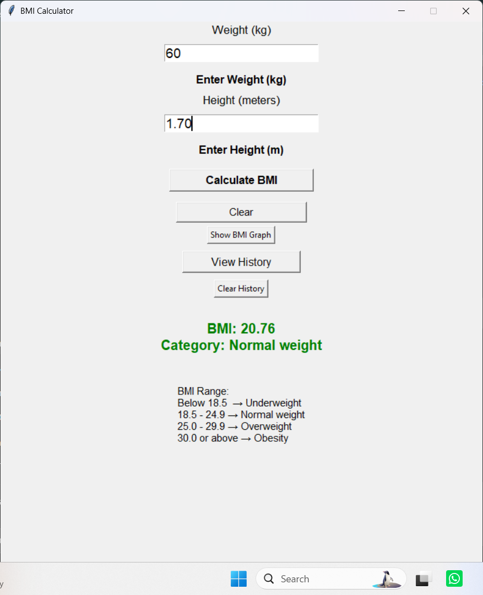

# 🧮 BMI Calculator

A simple and user-friendly **BMI (Body Mass Index) Calculator** developed using Python.

This project was created as part of the **Oasis Infobyte Internship**.

## 📌 About the Project

The BMI Calculator allows users to enter their height and weight and calculates their Body Mass Index (BMI).

The application also stores BMI calculation history using an SQLite database.

## 📸 Application Screenshot



## ✨ Features

- Calculate BMI based on height and weight
- Simple graphical user interface
- Display BMI value
- Show BMI category
- Store BMI calculation history
- View previous BMI records
- SQLite database integration
- Easy-to-use interface

## 🛠️ Technologies Used

- **Python**
- **Tkinter** – GUI
- **SQLite** – Database
- **Git & GitHub** – Version control

## 📂 Project Structure

```text
BMI_Calculator/
│
├── bmi_gui.py
├── bmi_calculator.py
├── bmi_history.db
└── README.md
